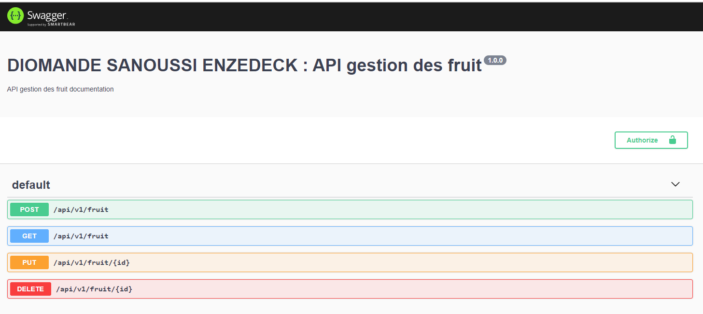

# DIOMANDE SANOUSSI ENZEDECK : Api gestion des fruit

> une simple API restful avec NodeJS, avec expressJS, mongoDB et Swagger


## Stack technique
  + mongodb 
  + express js
  + swagger

## Installation

```sh
npm install
```

## Development setup

```sh
npm start
```
api disponible a l'adresse <http://localhost:8080/api-doc/>



## Usage example

Ajouter un fruit a la base de donnee mongoDB.

Recuperer un fruit de la base de donnee mongoDB.

Modifier un fruit de la base de donnee mongoDB.

Supprimer un fruit de la base de donnee mongoDB.


